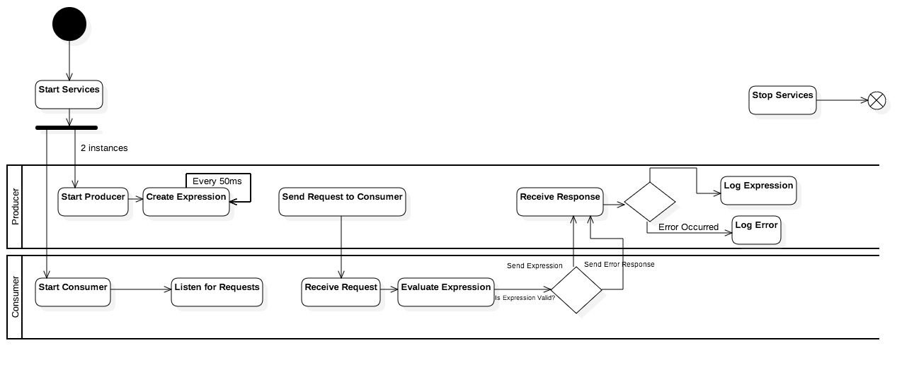
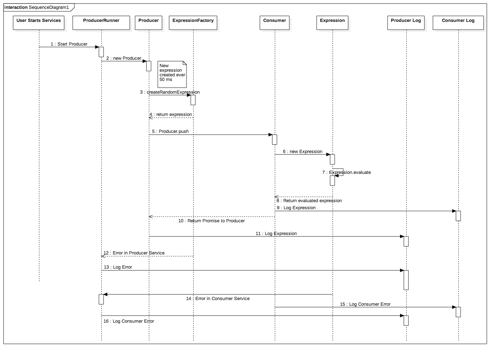

## Invision Producer / Consumer Challenge

[](https://travis-ci.org/tjboudreaux/invision-full-stack-challenge)
[](https://coveralls.io/github/tjboudreaux/invision-full-stack-challenge?branch=master)


### Challenge: Full-Stack

The assignment is to build a simple Producer/Consumer system. In this system the Generator will send a series of random arithmetic expressions, while the Evaluator will accept these expressions, compute the result and then report the solution to the Generator.

### Requirements

At a minimum, we would like to see the following implemented:

* The Producer and Consumer as separate NodeJS services.
* The Producer generating random addition expressions of two positive integers, e.g. "2+3="
* The Consumer computing and returning the correct mathematical result for the each expression it receives
* The Consumer successfully processing requests from two Producers concurrently at a rate of at least 1 req/sec from each Producer (2 req/sec in aggregate)
* The Consumer and Producer should log all messages they generate and receive.
* You are free to support more than simple addition, but it is not required.

The end product should:

* Be built in strict JavaScript and run with NodeJS
* NOT rely on any external services like Redis, ZeroMQ or similar technologies
* NOT use Express (Connect is Ok)
* Include UML Activity Diagram and UML Sequence Diagram documenting the business logic
* Include Unit tests

### UML Diagrams

* Activity Diagram 


* Sequence Diagram 


### Dependencies

* node v0.12.0
* forever ^0.15.1

### Installation Instructions

* Step 1. Install Forever via NPM
```
npm install -g forever
```

* Step 2. Clone Repository
```
git clone https://github.com/tjboudreaux/invision-full-stack-challenge.git
```

* Step 3. Run install script
```
./bin/install.sh
```

### Running Producers and Consumers

2 Producers and 1 Consumer can be started with the command  

```
./bin/start-all.sh
```

* All 3 processes will run via forever.
* After starting the services, you can view log output by running `tail -f logs/*.log`  

### Log Output

* Producers will write to the log file `./logs/producer.log`
* The Consumer will write to the log file `./logs/consumer.log`


